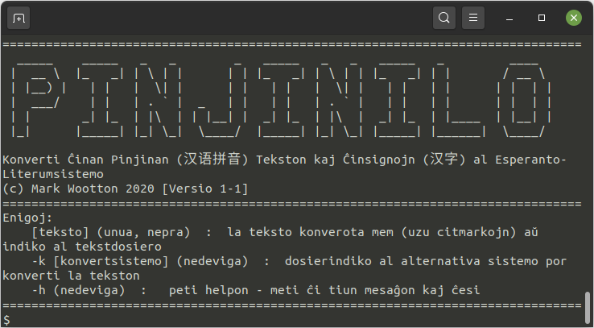

# * Pinjinilo*
## Konverti Ĉinan Pinjinan (汉语拼音) Tekston kaj Ĉinsignojn (汉字) al Esperanto-Literumsistemo

Pinjino estas sistemo por priskribi la sonojn de ĉinsignoj per latinaj literoj. La literoj uzataj malsamas al tiuj en la alfabeto de Esperanto, do la celo de ĉi tiu programo estas konverti de norma Pinjino aŭ ĉinsignoj al proksimumo laŭ la literumsistemo de Esperanto. Defaŭlte, ĝi uzas la [sistemon kreitan](https://eo.wikipedia.org/wiki/Esperantigo_de_vortoj_el_%C4%89ina_fonto) de la revuo [*El Popola Ĉinio*](https://eo.wikipedia.org/wiki/El_Popola_%C4%88inio) ([vidu suben](https://github.com/MJWootton/Pinjinilo#defa%C5%ADlta-konvertsistemo)), sed la uzanto povas uzi iun ajn sistemon, se oni kreas sian propran dosieron priskribantan ĝin.

Konsciu, ke *Pinjiinilo* nek estas tradukilo, nek konservas tonojn — ĝi nur produktas Esperanto-literan proksimumon de la elparolo de ĉinsignoj. Plie, iom da ĉinsignoj havas plurajn eblajn elparolojn, do se oni enigas tiajn, kontrolu la eligon.

<p align="center">
  
</p>


### Aŭtorrajto

© Mark Woottton 2020

### Bezonaĵoj

* [*Python 3*](https://www.python.org) kaj la jenaj moduloj de ekstera liveranto:
  * [*PySimpleGUI*](https://pysimplegui.readthedocs.io)
  * [*xpinyin*](https://pypi.org/project/xpinyin)
  * [*tkinter*](https://wiki.python.org/moin/TkInter) (Oni eble trovos, ke tiu jam estis instalita samtempe de Python mem)
  * [pyperclip](https://pypi.org/project/pyperclip) (Uzante Linukson, oni bezonas ankaŭ la ilojn [*xclip*](https://github.com/astrand/xclip) aŭ [*xsel*](https://github.com/kfish/xsel), kiuj haveblas en debianidoj per `sudo apt-get install xclip xsel`)
* [*PyInstaller*](https://www.pyinstaller.org) (nur por krei memstaran ruleblan dosieron)

### Uzado
Oni havas tri opciojn por uzi *Pinjinilon*:
* Per la komanda linio. Rulu la *Python3*-skripton *Funkcioj.py* kun la jenaj enigoj:
  1. `[teskto]` - La teksto, kiun oni volus konverti, aŭ indiko al tekstdosiero enhavanta ĝin
  2. `-k [konvertsistemo]`  - Iu alternativa sistemo por konverti la tekson (nedeviga)
  3. `-h`  - Montri helpmesaĝon (nedeviga)
* Per la grafika fasado. Rulu la *Python3*-skripton *Pinjinilo.py*
* Kiel memstaran programon. En la dosierujo *memstaraĵoj* troviĝas iom da ruleblaj dosieroj por diversaj operaciumoj. Se estas iu taŭga por onia komputilo, oni povas uzi ĝin por ruli *Pinjinilon* sen la bezono esti instalinta *Python*-interpretilon aŭ la modulojn de ekstera liveranto. Se neniu estas uzebla, oni povas krei sian propran per [*PyInstaller*](https://www.pyinstaller.org), uzante komandon el la la jenaj, kiu taŭgas por onia operaciumo:

*Linux*:

```bash
$ pyinstaller --onefile --noconsol --icon bildsimbolo/bildsimbolo.png Pinjinilo.py
```

*Windows*:
```bash
$ pyinstaller --onefile --noconsol --icon bildsimbolo/bildsimbolo.ico Pinjinilo.py
```

*MacOS*:
*Se oni ekscias, kiel funkciigi la memstaraĵon en MacOs, bonvole sciigu ankaŭ min*

### Krei Konvertsistemon
Por krei alian konvertsistemon, skribu ĝin en `*.csv` dosiero kun la jenan strukturon (ne inkluzivu la krampojn):
```
{nomo de konvertsistemo}
{pinjino 1},{esperantigo 1}
{pinjino 2},{esperantigo 2}
{pinjino 3},{esperantigo 3}
k.t.p......
```
Oni povas alvoki ĝin per alklako de la butono *Ŝanĝi konvertsistemon* en la grafika fasado aŭ per la `-k` opcio en la komandlinea versio de `Funkcioj.py`.

### Defaŭlta Konvertsistemo

La [defaŭlta konvertsistemo](https://eo.wikipedia.org/wiki/Esperantigo_de_vortoj_el_%C4%89ina_fonto) estis kreita de la ĉina Esperanto-revuo [*El Popola Ĉinio*](https://eo.wikipedia.org/wiki/El_Popola_%C4%88inio) kaj troviĝas en la jena tabelo. La litero "v" anstataŭiĝas per ''ü" je la komenco de konvertado.

| Pinjino | Esperantigo | Pinjino | Esperantigo | Pinjino | Esperantigo | Pinjino | Esperantigo |
|---------|-------------|---------|-------------|---------|-------------|---------|-------------|
| b       | b           | h       | h           | ei      | ej          | üe      | ŭe          |
| d       | d           | x       | ŝj          | en      | en          | iao     | jaŭ         |
| g       | g           | sh      | ŝ           | i       | i           | iou     | juŭ         |
| j       | ĝj          | s       | s           | e       | e           | uei     | ŭej         |
| zh      | ĝ           | f       | f           | ao      | aŭ          | uai     | ŭaj         |
| z       | z           | l       | l           | ang     | ang         | ian     | jan         |
| p       | p           | y       | j           | u       | u           | uen     | ŭen         |
| t       | t           | r       | ĵ           | ou      | oŭ          | üan     | ŭan         |
| k       | k           | w       | ŭ           | eng     | eng         | iang    | jang        |
| q       | ĉj          | a       | a           | er      | er          | iong    | jong        |
| ch      | ĉ           | ai      | aj          | ie      | je          | ueng    | ŭeng        |
| c       | c           | an      | an          | ia      | ja          | uang    | ŭang        |
| m       | m           | ü       | u           | üa      | ŭa          |         |             |
| n       | n           | o       | o           | uo      | ŭo          |         |             |
